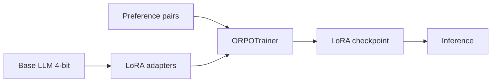

#### You are training a 13B code-generation model with GRPO using execution-based rewards: generated Python is run in a sandbox, and pass@1 on hidden tests determines the reward signal. Training initially improves HumanEval pass@1 from 42% to 58%, but after ~3k steps you observe (a) outputs become syntactically valid but use bizarre variable names and redundant logic that still passes tests, (b) pass@1 on a held-out "natural language spec" benchmark drops 6 points even though unit-test pass rate keeps climbing, and (c) average response length grows 2.3×, inflating inference cost. Explain the mechanistic link between GRPO's group-relative advantage estimation and each failure mode. Then design a revised training recipe—covering reward shaping, KL constraints, reference model choice, group size, curriculum, and evaluation—that targets robust spec-following without sacrificing test-pass rate. How would you detect reward hacking early using only logged rollouts, without waiting for downstream product metrics?
---

# QLoRA + ORPO — Interview Cheat Sheet

## 1. One-line mental model

**QLoRA** = train small **LoRA adapters** on a **4-bit frozen base model** (cheap on GPU).  
**ORPO** = align the model using **chosen vs rejected** pairs in **one stage** (no separate reward model, unlike RLHF).

---

## 2. Pipeline flow

```text
Base model (frozen, 4-bit)
        │
        ▼
Attach LoRA adapters (trainable)
        │
        ▼
Preference dataset (prompt + chosen + rejected)
        │
        ▼
ORPO loss = SFT on chosen + preference odds-ratio term
        │
        ▼
Save LoRA adapter only (~few MB)
        │
        ▼
Merge or load adapter at inference
```



---

## 3. ORPO vs DPO (interview answer)

| | **DPO** | **ORPO** |
|---|---------|----------|
| Stages | Often SFT **then** DPO | Can do **both in one** step |
| Reward model | No (implicit preference) | No |
| Key idea | Maximize log-ratio of chosen vs rejected | Adds **SFT + odds-ratio** preference loss |
| When to mention | Industry default, well-tested | Fewer stages, good when budget is tight |

**Interview line:** *"I'd use QLoRA to keep VRAM low, then ORPO when I want alignment without a separate SFT pass or reward model."*

---

## 4. Dataset format (minimum)

Each row needs **3 fields**:

```json
{
  "prompt": "User: How do I reset my password?\nAssistant:",
  "chosen": " Go to Settings > Security > Reset Password.",
  "rejected": " Just guess your old password."
}
```

For chat models, format with the model's **chat template** before training.

---

## 5. Minimal code (learning / interview reference)

```python
# pip install transformers peft trl bitsandbytes accelerate datasets

import torch
from datasets import Dataset
from transformers import AutoModelForCausalLM, AutoTokenizer, BitsAndBytesConfig
from peft import LoraConfig, get_peft_model, prepare_model_for_kbit_training
from trl import ORPOConfig, ORPOTrainer

MODEL = "Qwen/Qwen2.5-0.5B-Instruct"  # tiny model for learning

# --- 1) Tiny preference dataset ---
data = Dataset.from_dict({
    "prompt": [
        "User: What is RAG?\nAssistant:",
        "User: Should I fine-tune or use RAG?\nAssistant:",
    ],
    "chosen": [
        " RAG retrieves external docs, then the LLM generates an answer grounded in them.",
        " Use RAG when knowledge updates often; fine-tune when you need style, format, or task behavior.",
    ],
    "rejected": [
        " RAG is a type of neural network.",
        " Always fine-tune; RAG is never useful.",
    ],
})

# --- 2) Load model in 4-bit (QLoRA) ---
bnb = BitsAndBytesConfig(
    load_in_4bit=True,
    bnb_4bit_quant_type="nf4",
    bnb_4bit_compute_dtype=torch.bfloat16,
)
tokenizer = AutoTokenizer.from_pretrained(MODEL)
model = AutoModelForCausalLM.from_pretrained(
    MODEL, quantization_config=bnb, device_map="auto"
)
model = prepare_model_for_kbit_training(model)

# --- 3) LoRA ---
lora = LoraConfig(
    r=8,
    lora_alpha=16,
    target_modules=["q_proj", "k_proj", "v_proj", "o_proj"],
    lora_dropout=0.05,
    task_type="CAUSAL_LM",
)
model = get_peft_model(model, lora)

# --- 4) ORPO training ---
args = ORPOConfig(
    output_dir="./orpo_out",
    per_device_train_batch_size=1,
    gradient_accumulation_steps=4,
    learning_rate=5e-5,
    num_train_epochs=1,
    beta=0.1,              # preference strength (ORPO hyperparam)
    max_length=512,
    logging_steps=1,
)
trainer = ORPOTrainer(
    model=model,
    args=args,
    train_dataset=data,
    processing_class=tokenizer,
)
trainer.train()
trainer.save_model("./orpo_lora_adapter")
```

**What each piece does:**
- `BitsAndBytesConfig` → 4-bit base weights (QLoRA)
- `prepare_model_for_kbit_training` → stable gradients with quantized base
- `LoraConfig` → only adapters are trained
- `ORPOTrainer` → preference alignment loss
- `beta` → how strongly to prefer `chosen` over `rejected`

---

## 6. Interview flow (explain in ~60 seconds)

1. **Pick base model** — instruction-tuned, right size for GPU.
2. **Prepare preference data** — prompt + chosen + rejected.
3. **Quantize base to 4-bit** — freeze it; save VRAM.
4. **Attach LoRA** — train ~0.1–1% of parameters.
5. **Run ORPO** — model learns good answers **and** preference ranking together.
6. **Evaluate** — win-rate vs base, human review, task metrics.
7. **Ship adapter** — small file; merge or hot-load at inference.

---

## 7. Key hyperparameters to name

| Param | Typical | What it controls |
|-------|---------|------------------|
| `r` (LoRA rank) | 8–64 | Capacity vs overfitting |
| `lora_alpha` | 2× rank | Adapter scaling |
| `learning_rate` | 1e-5 – 5e-5 | Stability |
| `beta` (ORPO) | 0.05 – 0.3 | Preference vs SFT balance |
| `max_length` | 512–2048 | VRAM |
| `epochs` | 1–3 | Overfitting risk on small data |

---

## 8. Failure modes (senior interview points)

- **Length bias** — model learns longer `chosen` responses → normalize length in data.
- **Reward hacking** — fluent but wrong answers win → add factuality eval / rejection sampling.
- **Catastrophic forgetting** — mix general SFT data with preference data.
- **Overfitting** — tiny dataset + high rank → use low `r`, early stopping.
- **Format drift** — broken chat template → always tokenize with model template.

---

## 9. QLoRA + ORPO vs full SFT + DPO (ties to your mock question)

**QLoRA + ORPO path:**
- Lower GPU memory → larger model on same hardware
- One alignment stage → faster iteration
- Risk: less capacity than full fine-tune on hard reasoning tasks

**Full SFT + DPO path:**
- Better peak quality on big models
- More compute and tuning (two stages, LR schedules)
- Easier to debug each stage separately

**Decision rule:** *Ship QLoRA+ORPO when budget/VRAM is limited and task is style/format/alignment; use full SFT+DPO when reasoning quality is critical and you have GPU budget.*

---

## 10. Tiny local / Colab checklist

```text
[ ] NVIDIA GPU + CUDA PyTorch
[ ] pip install transformers peft trl bitsandbytes accelerate
[ ] 3–50 preference examples (even synthetic is fine for learning)
[ ] 0.5B–1.5B model first
[ ] batch_size=1, gradient_accumulation=4
[ ] Compare base vs adapter on same prompts
```

---

## 11. Sample interview Q&A

**Q: Why QLoRA instead of full fine-tuning?**  
A: Full FT updates all weights → high VRAM. QLoRA trains small adapters on a frozen 4-bit base → ~10× less memory, adapters are portable.

**Q: Why ORPO instead of RLHF?**  
A: RLHF needs a reward model + PPO (unstable, expensive). ORPO uses preference pairs directly, no reward model, and can combine SFT + alignment in one step.

**Q: What gets saved after training?**  
A: Only LoRA weights (adapters), not the full 7B model — typically tens to hundreds of MB.

